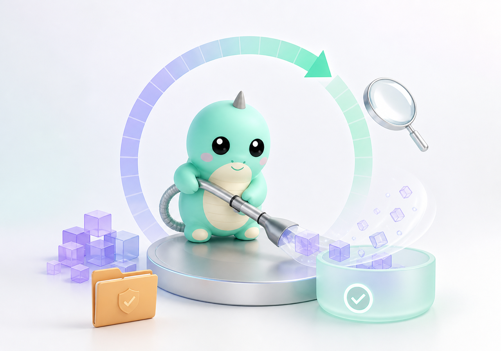

<div align="center">



# Juno

**See what is filling your Mac, understand what you can clear, and reclaim space without guesswork.**

A macOS desktop utility that finds cache clutter, explains where it came from, and helps you review and remove selected items.

</div>

## What it does

Juno scans 36 known cache and storage locations across popular Mac apps and developer tools. It measures each folder, ranks the results by size, and separates items that can be selected directly from folders that should be cleaned inside their owning app.

You can review the estimated space, approve the selection, clean it, and rescan your Mac to see the result. Optional AI guidance is available through Claude or a local Ollama model.

## Key features

- **Curated Mac scan** — checks known locations for browsers, communication apps, creator tools, Xcode, Docker, package managers, and more
- **Largest items first** — compare folder sizes and overall disk usage at a glance
- **Clear cleanup guidance** — selectable items are marked **safe to clear**; higher-risk items are marked **clean in app** with instructions
- **Small-cache filtering** — hide results under 50 MB by default or reveal them with one control
- **Review before deleting** — see the selected count and estimated space before confirming
- **Large-cleanup warning** — selections of 50 GB or more receive an additional warning
- **Optional AI explanations** — ask what a folder contains, whether it will be recreated, and whether its app should be closed first
- **Cloud or local AI** — use the Anthropic API or keep AI requests on your Mac with Ollama

## How to use

### Install the app

1. Download `Juno-1.0.0-universal.dmg` from the [latest release](https://github.com/productdave/juno-mac-cleaner-agent/releases/latest).
2. Open the DMG and drag **Juno** into **Applications**.
3. Eject the DMG and launch Juno from Applications.
4. On first launch, right-click **Juno**, choose **Open**, then choose **Open** again if macOS shows an unidentified-developer warning.

The current release is unsigned and unnotarized, so the one-time Gatekeeper step is expected.

### Clean selected caches

1. Launch Juno and let the initial scan finish.
2. Review the largest folders. Choose **Show small caches** to include results below 50 MB.
3. Select individual **safe to clear** items or choose **Select all safe**.
4. Follow the instructions shown for any item marked **clean in app**; these items cannot be selected in Juno.
5. Quit the apps associated with your selected caches.
6. Choose **Clean selected**, review the total, and confirm **Delete now**.
7. Rescan to verify the recovered space.

> Juno permanently deletes selected cache directories instead of moving them to Trash. There is no undo. Review the selection and close affected apps before confirming.

### Set up optional AI guidance

AI is not required for scanning or cleaning.

For Claude:

1. Open **Settings → Claude API**.
2. Enter an Anthropic API key and choose **Save key**.
3. Choose **Ask AI** beside any cache result.

Juno sends the selected cache's name, description, local path, size, classification, and your question to Anthropic. The key is stored in Juno's local settings file with owner-only permissions.

For a local model:

```bash
ollama pull gemma4
```

Open **Settings → Ollama (Local)**, enter the server URL and installed model name, then save. The default Ollama URL is `http://localhost:11434`.

## Run locally

### Requirements

- macOS 12+
- Node.js 18+
- npm

```bash
git clone https://github.com/productdave/juno-mac-cleaner-agent.git
cd juno-mac-cleaner-agent

npm install
npm run dev
```

Build the universal macOS DMG with:

```bash
npm run build
```

The output is written to `release/Juno-1.0.0-universal.dmg`.

## Tech stack

| Layer | Technology |
|---|---|
| Desktop app | Electron 33, React 18, Vite 6 |
| Disk analysis | Node.js filesystem and child-process APIs, macOS `du` and `df` |
| AI guidance | Anthropic Messages API, Ollama local chat API |
| App bridge | Context-isolated Electron preload and IPC |
| Packaging | electron-builder, universal macOS DMG |

## Status and limitations

Juno v1.0.0 is an unsigned, unnotarized macOS app available as a universal DMG for Apple Silicon and Intel Macs.

Juno scans a curated catalog of known locations rather than the entire disk. Safety classifications are maintained in that catalog and cannot guarantee how every future app version will use a folder. Items marked for manual cleanup and folders macOS denies access to cannot be selected through the app UI.

Cleanup permanently removes selected directories with no Trash recovery. Juno does not request administrator access. Scanning and cleanup happen locally; network requests occur only when AI guidance is used. There is no automated test suite, updater, or notarized distribution yet.
